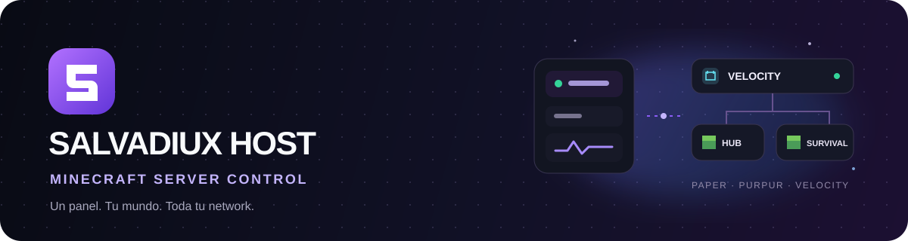
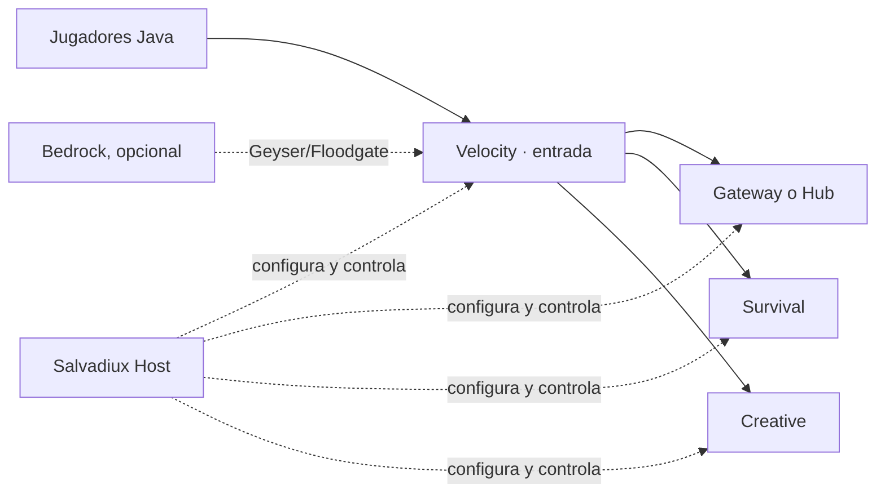

<div align="center">
  
  <br><br>
  
  
  
  <a href="LICENSE"></a>
  
</div>

<br>

<div align="center">

**Administra servidores Minecraft y conecta una network desde un solo panel.**

Salvadiux Host es un panel local para crear y gestionar instancias de Minecraft. Controla los procesos desde el dashboard y conecta servidores Paper/Purpur con un proxy Velocity usando una topología guiada.

[Inicio rápido](#-inicio-rápido) · [Crear una network](docs/crear-network.md) · [Contribuir](CONTRIBUTING.md) · [Servicios opcionales](deploy/network/README.md) · [Arquitectura](ARCHITECTURE.md)

</div>

<p align="center">
  
</p>

> ⚠️ **Proyecto en desarrollo:** puede contener errores, funciones incompletas o comportamientos que todavía necesitan pruebas. Haz copias de seguridad y pruébalo en un entorno local antes de usarlo con datos importantes.

---

## ✨ Qué puedes hacer

| Área                       | Funciones                                                                                                                   |
| -------------------------- | --------------------------------------------------------------------------------------------------------------------------- |
| **Servidores**             | Instalar y controlar builds de Paper, Purpur, Vanilla y Velocity; consola, archivos y configuración.                        |
| **Network**                | Conectar un proxy Velocity con backends Paper/Purpur, configurar modern forwarding y restaurar los archivos respaldados.    |
| **Jugadores**              | Consultar jugadores, administrar listas y revisar perfiles disponibles para la instancia.                                   |
| **Mundos**                 | Explorar mundos del servidor, gestionar sus archivos y consultar el mapa del mundo.                                         |
| **Operaciones**            | Plugins, backups, tareas programadas, estadísticas y preferencias visuales.                                                 |
| **Salvadiux Network Core** | `/hub`, selector de modalidades, `/spawn`, `/back` y perfiles separados de inventario y ubicación para Survival y Creative. |

### Una network, varias modalidades



El asistente prepara Velocity, los backends y el plugin Salvadiux. LuckPerms, Geyser/Floodgate y otros plugins conservan su propia instalación y configuración. MariaDB/Redis son opcionales y no reemplazan la base SQLite local del Host.

## 🚀 Inicio rápido

### Windows

1. Instala [Node.js 22 o superior](https://nodejs.org/) y pnpm 10.
2. Abre `INICIAR_SALVADIUX.bat`.
3. Espera a que termine la preparación y abre [http://127.0.0.1:5173](http://127.0.0.1:5173).
4. Mantén abierta la ventana de terminal mientras uses Host. Para cerrarlo, vuelve a esa ventana y pulsa `Ctrl+C`.

El launcher prepara las dependencias, compila el proyecto y levanta dashboard, API y agente. Java no necesita estar instalado globalmente: Host administra el runtime de las instancias.

### Terminal

```powershell
pnpm install
pnpm dev
```

Abre [http://127.0.0.1:5173](http://127.0.0.1:5173). Los datos de Host se guardan en `./data` por defecto; puedes cambiar esa ruta con `SALVADIUX_DATA_DIR`. Cerrar el navegador no detiene los servidores: deja Host abierto mientras las instancias estén en uso.

## 🧭 Crear tu primera network

1. Crea una instancia Velocity y los servidores Paper/Purpur para Gateway/Hub, Survival y las modalidades que quieras.
2. Inicia cada instancia una vez para generar su configuración inicial y luego detenlas.
3. Si hace falta, compila Network Core en Windows con `COMPILAR_NETWORK_CORE.bat`.
4. Entra a **Network topology**, selecciona Velocity, agrega los backends y asigna sus roles y alias.
5. Aplica la topología segura y administra el conjunto desde **Network overview**.

La topología requiere que todos los backends usen la misma versión de Minecraft, estén detenidos y enlazados a loopback. El proxy conserva la autenticación online. Para entender cada paso y revisar errores frecuentes, sigue la **[guía completa para crear una network](docs/crear-network.md)**.

## 🧰 Servicios opcionales

El perfil Docker de `deploy/network` puede iniciar MariaDB y Redis para plugins que necesiten servicios compartidos. No es requisito para iniciar Host ni para crear una topología. Host no configura automáticamente las credenciales o las bases de cada plugin.

```powershell
Set-Location .\deploy\network
Copy-Item .env.example .env
notepad .env
docker compose --env-file .env -f compose.yaml up -d
docker compose --env-file .env -f compose.yaml ps
```

Antes de iniciar, sustituye todos los valores de ejemplo por secretos distintos. Los puertos se enlazan a `127.0.0.1`; no los publiques en Playit ni en el firewall. Redis está preparado para usos futuros y actualmente no forma parte del almacenamiento de perfiles de Network Core. Consulta [la guía de servicios privados](deploy/network/README.md).

## 🔌 Playit, Java y Bedrock

Para Java, el túnel público debe llegar al puerto de entrada de Velocity. No expongas directamente los puertos de Hub, Survival o Creative. Bedrock necesita Geyser/Floodgate y un túnel UDP compatible; esos plugins requieren configuración propia. El dashboard muestra los destinos locales para los túneles.

## 🛠️ Desarrollo y comprobaciones

Requisitos: Windows 11 o Linux actual, Node.js 22+, pnpm 10 y conexión a Internet para las descargas iniciales.

```bash
pnpm lint
pnpm typecheck
pnpm test
pnpm build
```

Para compilar el plugin de Minecraft se requiere JDK 21:

```powershell
./server-plugin/gradlew --no-daemon -p server-plugin build
```

En Windows también puedes usar `COMPILAR_NETWORK_CORE.bat`. El JAR resultante se instala en los backends al crear la topología.

## 🗂️ Documentación

- [Crear una network paso a paso](docs/crear-network.md)
- [MariaDB y Redis con Docker Compose](deploy/network/README.md)
- [Arquitectura del proyecto](ARCHITECTURE.md)
- [Cómo contribuir](CONTRIBUTING.md)
- [Proveedores y descargas](PROVIDERS.md)
- [Pruebas](TESTING.md)
- [Seguridad](SECURITY.md)
- [Cambios del proyecto](CHANGELOG.md)

## 🫶 Código abierto y contribuciones

El proyecto usa la licencia MIT: cualquiera puede revisar el código, hacer un fork y proponer mejoras mediante Pull Requests. Las propuestas y errores tienen plantillas para que sean más fáciles de reproducir y revisar. Las contribuciones no se incorporan automáticamente: el equipo del proyecto las revisa antes de integrarlas. Consulta [CONTRIBUTING.md](CONTRIBUTING.md) para participar.

Salvadiux Host es un proyecto personal. Todavía estoy aprendiendo los lenguajes y herramientas que utiliza, y me apoyé en inteligencia artificial para desarrollarlo y entender partes del código. Por eso puede haber errores o decisiones que se puedan mejorar; agradezco la paciencia, las revisiones y las contribuciones respetuosas.

Si encuentras un problema, escríbeme a **[salvadiux2@gmail.com](mailto:salvadiux2@gmail.com)** o [abre un reporte](https://github.com/salvadiux/salvadiux-host/issues/new/choose). Incluye los pasos para reproducirlo y lo que esperabas que ocurriera. Antes de compartir registros, elimina contraseñas, tokens, webhooks y otros datos privados.

## 🔐 Antes de publicar o exponer el panel

- No compartas `.env`, tokens, `forwarding.secret`, configuraciones con credenciales, mundos, backups ni datos de jugadores.
- `data/`, `.env`, builds y logs están excluidos por `.gitignore`; comprueba siempre `git status` antes de preparar una publicación.
- El panel está diseñado para control local. No lo expongas a Internet sin configurar autenticación, origen permitido y un despliegue seguro.
- La topología actual usa `online-mode = true` en Velocity. Aceptar cuentas no premium necesita un flujo de autenticación compatible, no solo cambiar una propiedad.

## 📜 Créditos y marcas

Salvadiux Host es un proyecto independiente y no está afiliado a Mojang ni a Microsoft. Minecraft es una marca de Microsoft. Los recursos visuales de terceros conservan sus licencias junto a los archivos correspondientes.
