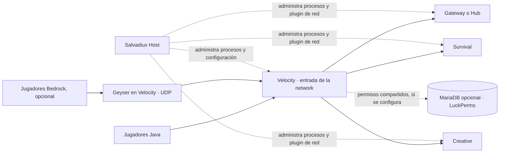

# Crear una network de Minecraft con Salvadiux Host

Esta guía explica cómo pasar de varios servidores locales a una network conectada por Velocity. Está escrita para la instalación de Windows de Salvadiux Host y describe lo que el proyecto configura hoy.

## Qué crea Salvadiux Host y qué no

Salvadiux Host administra procesos y archivos de instancias. Al aplicar **Network topology**, conecta un proxy Velocity con backends Paper/Purpur detenidos, genera la configuración de reenvío moderno, instala Salvadiux Network Core y conserva copias de los archivos que modifica para poder restaurarlos. Después, la vista **Network overview** puede iniciar o detener el conjunto en el orden adecuado.

La base de datos interna del Host usa SQLite para guardar datos del panel. No es una base SQL compartida para plugins. MariaDB y Redis son servicios opcionales: Docker Compose los puede iniciar, pero Host no crea automáticamente las bases, usuarios y credenciales que cada plugin necesita ni cambia por sí solo la configuración de LuckPerms, Geyser u otros plugins. Las funciones de inventario y ubicación entre Hub, Survival y Creative del plugin de red usan el API local del Host y su almacenamiento local; Redis actualmente no participa en ese flujo.



MariaDB y Redis deben quedarse privados. No los publiques en Playit ni abras sus puertos en el router/firewall.

## Requisitos

- Salvadiux Host ejecutándose con Node.js y pnpm disponibles.
- Instancias del proxy Velocity y de cada backend que quieras conectar.
- Al menos un backend **Paper o Purpur** que actúe como **Hub** o **Gateway**. Añade Survival, Creative u otras modalidades como backends adicionales.
- Todos los backends conectados deben usar la misma versión de Minecraft y estar enlazados a `127.0.0.1`.
- JDK 21 para compilar Salvadiux Network Core, si todavía no existe `server-plugin/build/libs/SalvadiuxNetworkCore-0.1.0.jar`.
- Docker Desktop solo si quieres instalar servicios opcionales como MariaDB/Redis. No es requisito para crear la network ni para usar el almacenamiento local del plugin de red.

La configuración de network de este proyecto deja `online-mode = true` en Velocity y configura los backends como servidores detrás del proxy. Por eso, el asistente actual está orientado a autenticación normal de Minecraft. Para aceptar cuentas no premium hace falta diseñar y probar un flujo de autenticación compatible con Velocity; no basta con cambiar un único ajuste.

## 1. Crea las instancias

En Salvadiux Host, crea una instancia Velocity y las instancias Paper/Purpur que vayas a usar. Una distribución inicial puede ser:

| Software | Rol en la network | Alias sugerido |
|---|---|---|
| Velocity | Proxy y punto de entrada | lo administra el proxy |
| Paper/Purpur | Gateway o Hub | `gateway` o `hub` |
| Paper/Purpur | Survival | `survival` |
| Paper/Purpur | Creative | `creative` |

Puedes agregar más backends con roles de minijuegos o eventos desde el formulario de topología. El **alias** debe ser único, comenzar con una letra y solo usar letras minúsculas, números, guiones o guiones bajos.

Inicia cada instancia una vez para que genere sus archivos iniciales; luego apágala desde Host y espera a que figure detenida. La configuración de topología requiere Velocity y todos los backends detenidos. Para la primera prueba, conserva todos los servidores en este mismo equipo y en loopback.

## 2. Compila Network Core si hace falta

La creación de topología falla si el JAR del plugin no está compilado. En Windows, ejecuta `COMPILAR_NETWORK_CORE.bat` desde la carpeta del proyecto y espera el mensaje de éxito. El archivo esperado es:

```text
server-plugin/build/libs/SalvadiuxNetworkCore-0.1.0.jar
```

No tienes que copiarlo a cada instancia manualmente: Host lo instala en los backends al aplicar la topología.

## 3. Aplica la topología

1. Abre el dashboard y entra en **Network topology**. Si aún no existe una network, usa **Create topology**.
2. Escribe el nombre de la network y selecciona la instancia Velocity.
3. Añade cada backend, asigna su rol y define un alias único. Incluye Hub o Gateway para que Velocity tenga un destino inicial.
4. Comprueba que todos los backends usan la misma versión y que están detenidos y enlazados a `127.0.0.1`.
5. Pulsa **Apply secure topology** y espera el resultado.

Host escribe `velocity.toml`, activa el reenvío moderno de Velocity en Paper, configura las direcciones loopback, instala Network Core y crea su configuración con el token de servicio de esa network. También guarda copias de seguridad de los archivos que modifica. El token y `forwarding.secret` son secretos: no los publiques ni los compartas en capturas o repositorios.

Los nodos mostrarán que necesitan reiniciarse. La vista de network arranca primero Gateway/Hub, después los modos y al final Velocity; al detener, cierra primero el proxy. Usa **Network overview → Start all** y **Stop all** para operar el conjunto.

## 4. (Opcional) Prepara MariaDB y Redis

Haz este paso solo si un plugin que vas a instalar necesita almacenamiento compartido. LuckPerms, por ejemplo, puede usar MariaDB para compartir rangos entre servidores. El asistente de topología no configura esos plugins por ti.

Desde PowerShell:

```powershell
Set-Location .\deploy\network
Copy-Item .env.example .env
notepad .env
```

En `.env`, reemplaza cada valor `REPLACE_WITH_...` con un secreto largo y distinto. Después inicia y verifica los servicios:

```powershell
docker compose --env-file .env -f compose.yaml up -d
docker compose --env-file .env -f compose.yaml ps
```

Espera a que MariaDB y Redis aparezcan saludables. Configura LuckPerms y cualquier otro plugin con sus propias credenciales, siguiendo la documentación de ese plugin. El perfil Compose publica ambos puertos solo en `127.0.0.1`; conserva ese enlace. Redis está provisionado para usos futuros, pero el sistema actual de perfiles de Network Core no lo utiliza.

Para apagar los servicios opcionales:

```powershell
docker compose --env-file .env -f compose.yaml down
```

Ese comando conserva los volúmenes de datos. No uses `down -v` salvo que quieras borrar las bases de datos.

## 5. Entra y verifica

Con la network iniciada, conecta Minecraft al puerto público/local de Velocity, no al puerto de un backend. Comprueba:

- Network overview muestra Velocity y los backends en línea.
- Al entrar, el jugador llega al Gateway o Hub configurado.
- El selector del Hub lleva a Survival/Creative y `/hub` permite volver.
- `/spawn` y `/back` funcionan según el modo.
- El inventario y la ubicación de Survival se mantienen separados de Creative.
- Consola y `logs/latest.log` no muestran errores de plugin o de forwarding.

Playit debe apuntar al punto de entrada Velocity: un túnel Java TCP para jugadores Java. Para Bedrock se necesita instalar y configurar Geyser/Floodgate en la arquitectura adecuada y crear además un túnel UDP compatible con Playit. El asistente de network no instala ni configura esos plugins. Nunca apuntes el túnel público directamente a los puertos de los backends.

Si recibes `EADDRINUSE`, ya hay un proceso usando ese puerto. Reutiliza el Host que ya está activo o detén la instancia desde su control correspondiente antes de iniciar otra; no abras varias copias del launcher.

## 6. Cambiar o deshacer la topología

Para agregar backends o cambiar roles, detén todos los nodos afectados antes de editar la topología. Para quitar la network y devolver los archivos guardados, detén proxy y backends y usa **Restore original configs**. No borres manualmente `data/` mientras quieras conservar instancias, mundos, copias de seguridad y estado local.

## Preparar el proyecto para GitHub

El proyecto ya contiene un `.gitignore` que excluye `.env`, `data/`, dependencias, builds y logs. Antes de publicar, revisa el estado y confirma que no se incluyan secretos, tokens de network, `forwarding.secret`, mundos, inventarios, backups, logs ni configuraciones privadas. Mantén los archivos de ejemplo (`.env.example`) con marcadores, nunca con contraseñas reales.

Desde la raíz del proyecto, revisa:

```powershell
git status --short
git check-ignore -v .env data deploy/network/.env
```

No subas una network local operativa al repositorio. Publica el código, la documentación y ejemplos limpios; deja los datos de las instancias y los secretos en la máquina del servidor. Esta guía prepara el proyecto para esa revisión, pero no publica ni sube cambios a GitHub.

## Problemas comunes

| Síntoma | Qué revisar |
|---|---|
| No aparece Velocity en el selector | Crea una instancia con software Velocity e iníciala una vez para generar `velocity.toml` y `forwarding.secret`; después detenla. |
| La topología dice que falta Network Core | Ejecuta `COMPILAR_NETWORK_CORE.bat` y vuelve a aplicar la topología. |
| El backend rechaza la conexión del proxy | Confirma la versión, loopback, que los archivos se hayan aplicado y que todos los nodos se hayan reiniciado. |
| Un backend no aparece como elegible | Confirma que sea Paper/Purpur, comparta versión con los demás, no pertenezca a otra network y esté detenido. |
| Los comandos o plugins de otro servidor no funcionan | Network Core no sustituye LuckPerms, EssentialsX, Geyser/Floodgate u otros plugins; instálalos y configúralos por separado. |
| Docker inicia pero un plugin no comparte permisos | El contenedor solo aprovisiona MariaDB/Redis; configura el plugin con la misma base, usuario y mensajería en cada backend/proxy compatible. |
